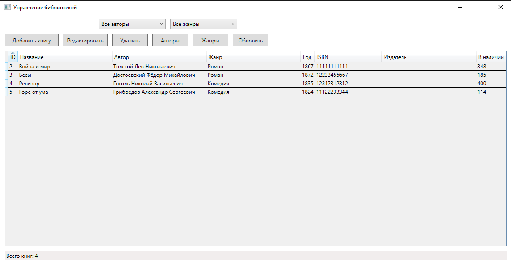
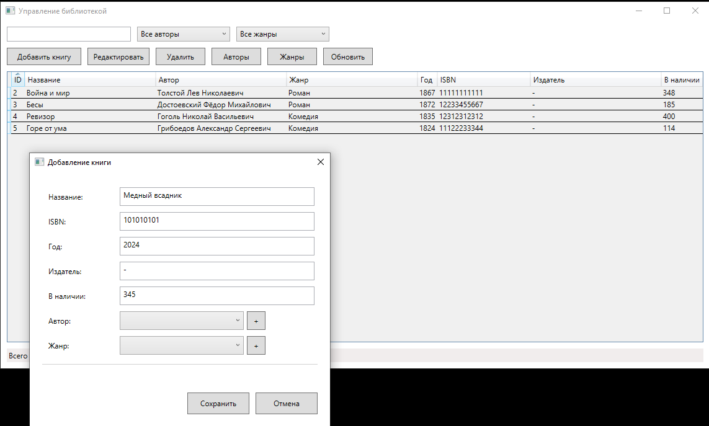
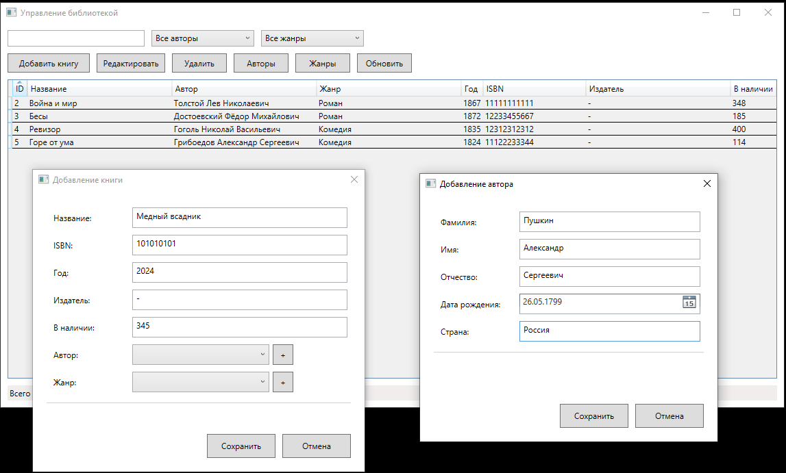
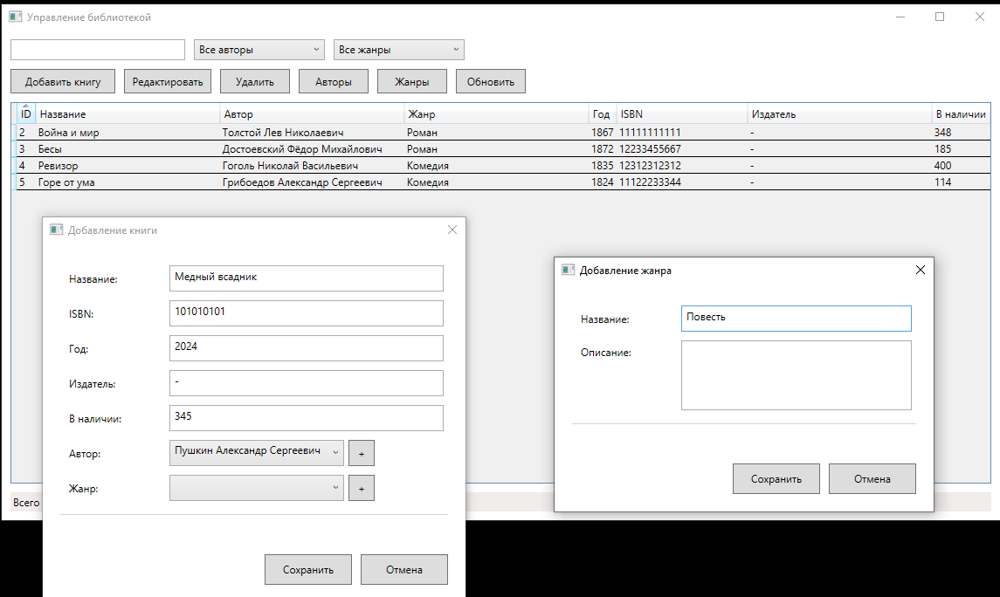
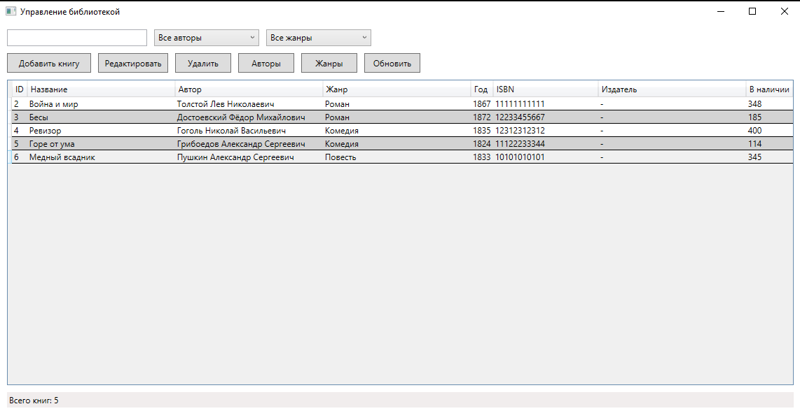
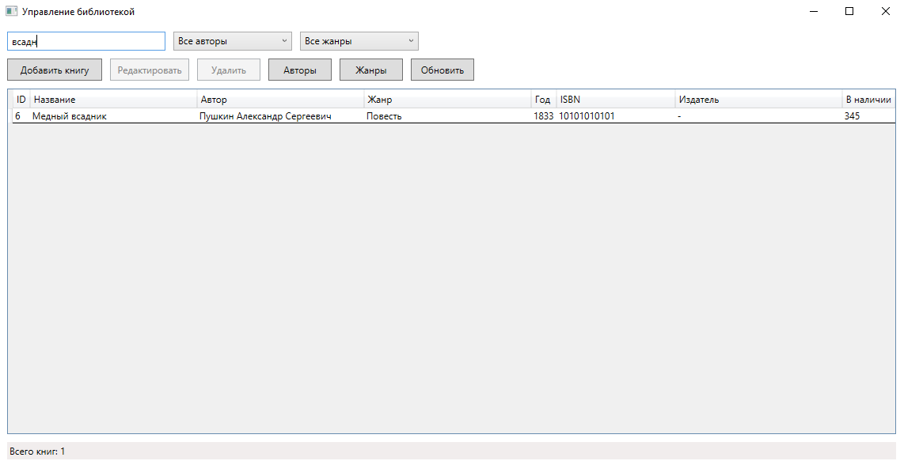
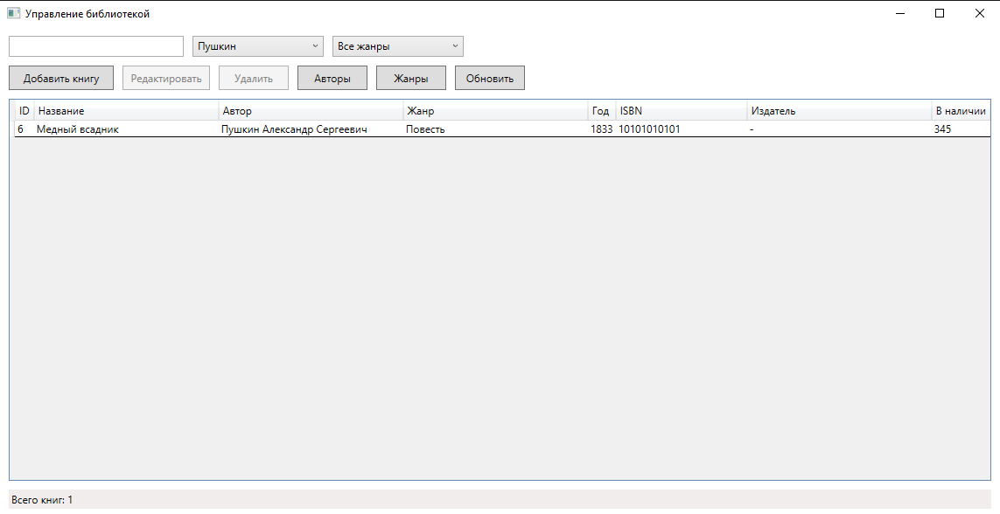
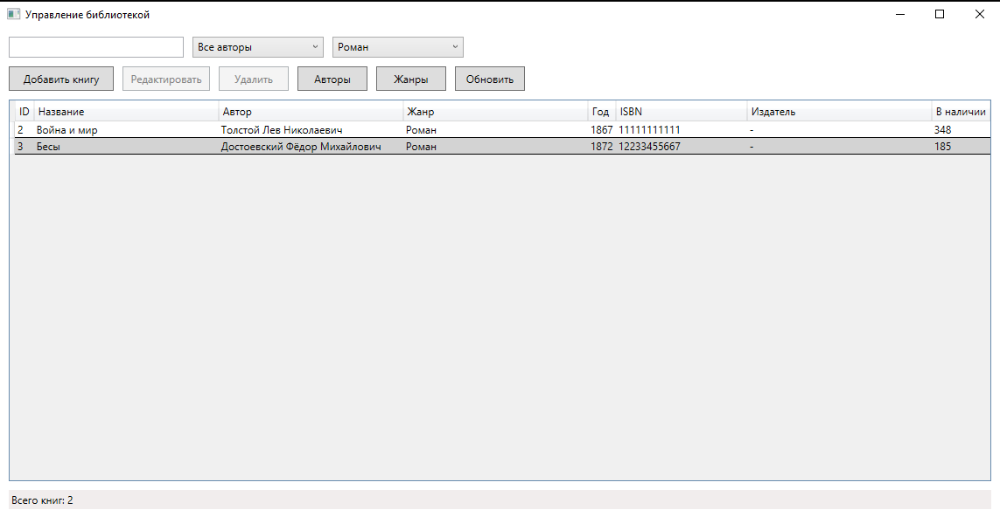
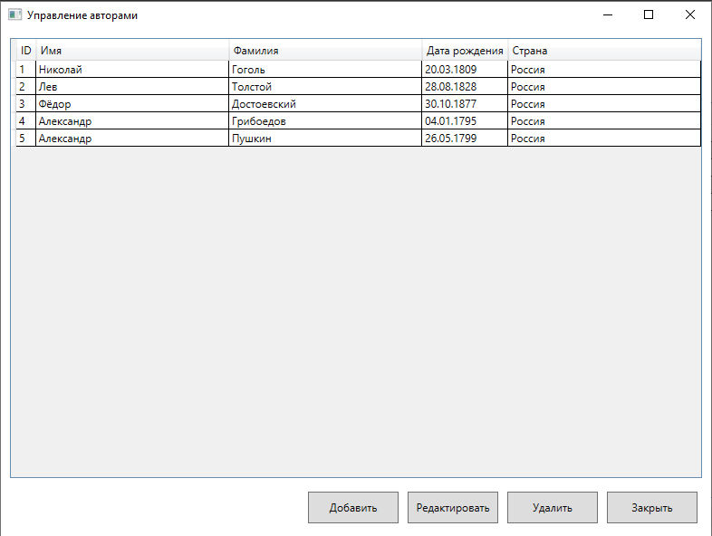
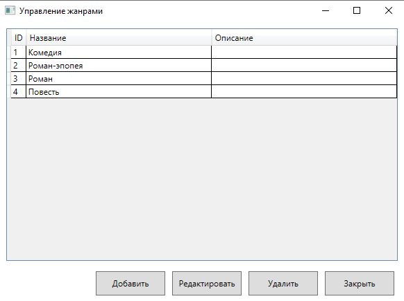

### 1. Главное окно приложения
На главном окне отображается список всех книг, панель фильтрации (поиск по названию, выбор автора и жанра), кнопки управления и строка состояния с общим количеством книг.

### 2. Окно добавления новой книги
При нажатии кнопки "Добавить книгу" открывается окно с полями для ввода данных. Реализована возможность быстрого добавления автора или жанра через кнопки "+".

### 3. Окно добавления нового автора
Окно, открывающеяся при нажатии "+" при выборе автора.

### 4. Окно добавления нового жанра
Окно, открывающеяся при нажатии "+" при выборе жанра.

### 5. Результат добавления книги
После сохранения новой книги она отображается в общем списке.

### 6. Поиск по названию
Пример поиска по названию.

### 7. Фильтрация по автору
Фильтр для выбора книг определнного автора.

### 8. Фильтрация по жанру
Фильтр для отображения книг определенного жанра.

### 9. Окно управления авторами
Окно для редактирования авторов. При попытке удалить автора, у которого есть книги, выводится предупреждение.

### 10. Окно управления жанрами
Аналогичное окно для редактирования жанров.
